# **Image Captioning Using Attention Mechanism**

## **MENTORS**

- Chandan Kumar
- Rohan Rao H J

## **MENTEES**

1. Aakaash G.Acharya
2. Apurva S
3. Deepanshu Gupta
4. Inbasekaran.P
5. K A Gaganashree

### **ABSTRACT**

In this project, we systematically analyze a deep neural networks based image caption generation method. With an image as the input, the method can output an English sentence describing the content in the image.We analyze three components of the method: Convolution Neural Network (CNN), Recurrent Neural Network (RNN) and sentence generation. By replacing the CNN part with three state-of-the-art architectures, we find the Inception v3 performs best according to the BLEU (Bilingual Evaluation Understudy) score. We also propose a simplified version the Gated Recurrent Units (GRU) as a new recurrent layer. The simplified GRU achieves comparable result when it is compared with the long short-term memory (LSTM) method. But it has few parameters which saves memory and is faster in training. Finally, we generate multiple sentences using Greedy Search. The experiments show that the modified method can generate captions comparable to the-state-of-the-art methods with less training memory

### **INTRODUCTION**

Automatically describing the content of images using natural languages is a fundamental and challenging task. It has great potential impact. For example, it could help visually impaired people better understand the content of images on the web. Also,it could provide more accurate and compact information of images/videos in scenarios such as image sharing in social network or video surveillance systems. This project accomplishes this task using deep neural networks. By learning knowledge from image and caption pairs, the method can generate image captions that are usually semantically descriptive and grammatically correct.
The idea is mapping the image and captions to the same space
and learning a mapping from the image to the sentences.

The GRU is like a long short-term memory (LSTM) with a forget gate, but has fewer parameters than LSTM, as it lacks an output gate. GRU's performance on certain tasks of polyphonic music modeling, speech signal modeling and natural language processing was found to be similar to that of LSTM. GRUs have been shown to exhibit better performance on certain smaller and less frequent datasets.
Although all the mappings are learned in an end to-end framework, we believe the benefits of better
understanding of the system by analyzing different
components separately.

Attention models, or attention mechanisms, are input processing techniques for neural networks that allows the network to focus on specific aspects of a complex input, one at a time until the entire dataset is categorized. The goal is to break down complicated tasks into smaller areas of attention that are processed sequentially. Similar to how the human mind solves a new problem by dividing it into simpler tasks and solving them one by one.
The model has three components. The first component is a CNN which is used to understand the content of the image. Image understanding answers the typical questions in computer vision such as “What are the objects?”, “Where are the objects?” and “How are the objects interactive?”.The second component is a RNN which is used to generate a sentence given the visual feature.The third component is used to generate a sentence by exploring the combination of the probabilities. So major objective about the project is to learn CNN concepts and LSTM model and build a working model of Image caption generator by implementing CNN with LSTM.

### **CONVOLUTIONAL NEURAL NETWORK AND TRANSFER LEARNING**

In this project, Convolution Neural Network (CNN) acts as an encoder. It extracts features from the input image.Every image is reshaped and converted into a vector of fixed size when it is given as an input to the CNN model. Some of the commonly used layers in CNN are convo layer, fully connected layer, pooling layer, dropout layer etc.Two important components of CNN are Rectified Linear Unit and Dropout layers. ReLU is used as activation function to bring about non linearity [(ReLU) f(x) = max(0, x)]. Dropout randomly nullifies the contribution of some neurons of a layer. So use of Dropout layers helps in preventing over fitting of training data.The last hidden state of the CNN is connected to the decoder.

#### **A. Why Transfer Learning?**

We can either train CNN from scratch or make use of a pre trained model, trained on a larger dataset and its weights. The latter method is called as transfer learning. Studies have shown that image captioning models trained using the second method perform better. Transfer learning also helps in training the model faster. So in this project we make use of Inception V3. Inception-v3 is a convolutional neural network trained on ImageNet dataset. It consists of 48 layers. Images of size 299 by 299 are fed as input into this network. Shape of output of last layer is 8 by 8 by 2048. We use the last convolutional layer because we are using attention in this project.

#### **B. Inception V3 architecture**

1. Factorized Convolutions: reduce the number of parameters involved in the network. This helps in reducing the computational efficiency. This also keeps a check on the network efficiency.
2. Smaller convolutions: replacing bigger convolutions with smaller convolutions results in faster training.
3. Asymmetric convolutions: A 3 × 3 convolution could be replaced by a 1 × 3 convolution followed by a 3 × 1 convolution.
4. Auxiliary classifier: An auxiliary classifier is a small CNN inserted between layers during training, and the loss incurred is added to the main network loss. In Inception v3 an auxiliary classifier acts as a regularizer.
5. Grid size reduction: Grid size reduction is usually done by pooling operations.

  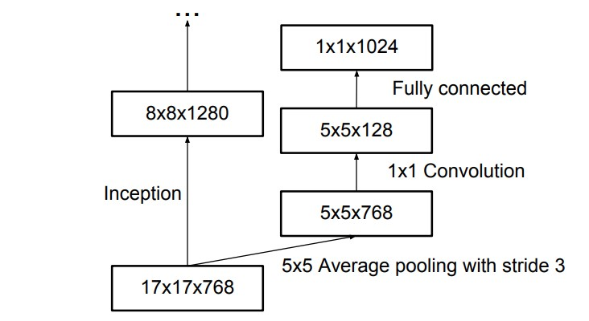

**Final Architecture**
All the above concepts are consolidated into the final architecture.

  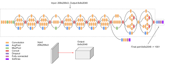

#### **C. Why Inception V3?**

Inception v3 focuses on burning less computational power.Compared to VGGNet, Inception Networks have proved to be more computationally efficient, in terms of the number of parameters generated and the economical cost incurred (regarding memory and other resources).

### **SEQUENTIAL MODELS: RNN'S AND GRU**

Traditional feed-forward neural networks take in a fixed amount of input data all at the same time and produce a fixed amount of output each time. On the other hand, RNNs do not consume all the input data at once. Instead, they take them in one at a time and in a sequence. At each step, the RNN does a series of calculations before producing an output. The output, known as the hidden state, is then combined with the next input in the sequence to produce another output.
A Gated Recurrent Unit (GRU), as its name suggests, is a variant of the RNN architecture, and uses gating mechanisms to control and manage the flow of information between cells in the neural network. GRUs were introduced only in 2014 by Cho, et al. The structure of the GRU allows it to adaptively capture dependencies from large sequences of data without discarding information from earlier parts of the sequence. This is achieved through its gating units, which solve the vanishing/exploding gradient problem of traditional RNNs.

  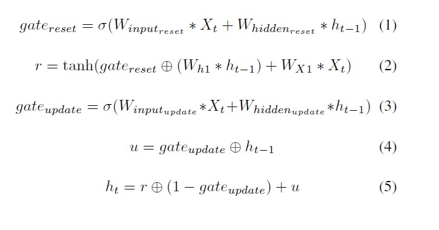

  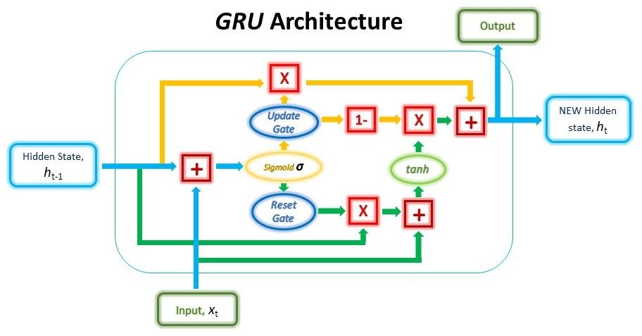

### **ATTENTION MECHANISM:**

The standard seq2seq model is generally unable to accurately process long input sequences, since only the last hidden state of the encoder RNN is used as the context vector for the decoder. On the other hand, the Attention Mechanism directly addresses this issue as it retains and utilises all the hidden states of the input sequence during the decoding process. It does this by creating a unique mapping between each time step of the decoder output to all the encoder hidden states. This means that for each output that the decoder makes, it has access to the entire input sequence and can selectively pick out specific elements from that sequence to produce the output.

#### **A.Bahadanau's Attention Mechanism**

Bahdanau’s Attention, commonly referred to as Additive Attention, came from a paper by Dzmitry Bahdanau. The model aimed at improving the sequence-to-sequence model in machine translation by aligning the decoder with the relevant input sentences and thereby implementing Attention.

  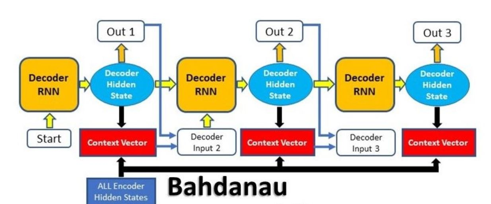

#### **B.Steps involved in Attention Mechanism**

The entire step-by-step process involved in attention model is as follows:
1.Producing the Encoder Hidden States - Encoder produces hidden states of each element in the input sequence
2.Calculating Alignment Scores between the previous decoder hidden state and each of the encoder’s hidden states are calculated (Note: The last encoder hidden state can be used as the first hidden state in the decoder)
3.Softmaxing the Alignment Scores - the alignment scores for each encoder hidden state are combined and represented in a single vector and subsequently softmaxed
4.Calculating the Context Vector - the encoder hidden states and their respective alignment scores are multiplied to form the context vector
5.Decoding the Output - the context vector is concatenated with the previous decoder output and fed into the Decoder RNN for that time step along with the previous decoder hidden state to produce a new output
6.The process (steps 2-5) repeats itself for each time step of the decoder until an token is produced or output is past the specified maximum length

  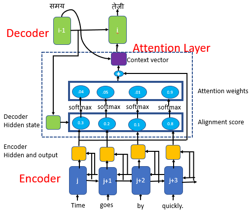

### **EXPERIMENTS**

In this section, we evaluate the proposed network architectures on a real image captioning dataset.

#### **A.Dataset**

There are many datasets for image captioning.
We planned to use the Common Objects in Context (COCO) dataset from Microsoft, however, due to computational and algorithmic limitations, we decided to limit the scope of our project to
1)Flickr8k
The dataset consists of about 8K images bifurcated as follows:
**Training Set** - 6000 images
**Dev Set** - 1000 images **Test Set**- 1000 images
Each image contains 5 sentences of around 10-20 words.

#### **B.Metrics**

The objective of Machine learning is to generate a new sequence of most probable caption of an image based on the available corpus words of testing dataset. Thus, we need a way to quantify the average accuracy of the system on the whole dataset. There are several metrics by which to judge the quality of machine-produced text and none without criticism.\par We chose to use the Bilingual Evaluation Understudy (BLEU) metric, as it is one of the simplest and best known.BLEU is an algorithm for evaluating the quality of text which has been machine-translated from one natural language to another. Before describing the BLEU score, we will describe a simpler and better known metric, called the precision. Let x be a vector of machine-produced n-grams, and let y be a vector of ground truth n-grams. For example, x could be the words in a sentence describing a movie frame,with xi representing an individual word, and y could be words from scripts describing the same scene. We often wish to have a ground truth y representing the many possible linguistic translations of the same idea.The precision is {x belongs to y}

  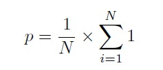

The BLEU score is similar to the precision, except that each occurrence of an n-gram in y can account for only one occurrence in x. For example, the statement The the the the the the would receive a perfect precision if the reference translation contained the word the,but not necessarily a perfect BLEU score, as we are limited to counting only as many occurrences of the as appear in y.
An individual N-gram score is the evaluation of just matching grams of a specific order, such as single words (1-gram) or word pairs (2-gram or bigram).
The weights are specified as a tuple where each index refers to the gram order. To calculate the BLEU score only for 1-gram matches, you can specify a weight of 1 for 1-gram and 0 for 2, 3 and 4 (1, 0, 0, 0).

_Note:_
BLEU 1 : Unigram BLEU Score
BLEU 2 : Bigram BLEU Score
BLEU 3 : Trigram BLEU Score

#### **C.Results**

- The results in our experiments so far are encouraging .We trained the basic decoder model with one layer of GRU, a hidden state of length 512, and a word embedding of length 256.The maximum length of the generated sequence was 38 words

- Image features of length 2048 were extracted using a pretrained Inception v3 model.To optimize the GRU model parameters, we used the Adam descent method in batches of 100 pairs of images and captions.

- To make the classification problem feasible, the vocabulary was restricted to the 2,000 most common words from the 8K dataset. All other words were replaced with a special unknown token < unk >.

- All tokens less than 38 words in length were padded with a special unknown token, signifying that no more words are needed to describe the image. Note that the 38-word limit includes < startofseq > and < endofseq > tokens enclosing each caption.

- After thesWhile many captions are informative, some describe a scene completely different than the one in the image, while others are complete gibberish. It should be noted that most gibberish captions make use of the < unk > token. e modifications, the model was trained for 30 epochs, on 8K dataset.We could achieve an accuracy of 98.16\% on train set and an accuracy of 97.8\% on test set. Refer Fig 5 for the Loss plot

  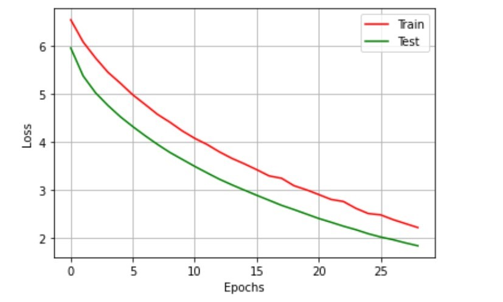

- While many captions are informative, some describe a scene completely different than the one in the image, while others are complete gibberish. It should be noted that most gibberish captions make use of the < unk > token.

- We used a pretrained model for Inception v3 (CNN) with ImageNet weights and implemented the Decoder in TensorFlow.

- The qualitative results of this model are quite interesting. For many images, the model generates informative and relevant captions. To qualitatively assess the accuracy of our model, we report the world-level BLEU score, as discussed in section V.B on our validation set. All start, end, null tokens are stripped from both the predicted and ground truth captions prior to computing BLEU. Note that we exclude the unknown tokens when computing BLEU.

- The next page contains some captions generated by our neural network

  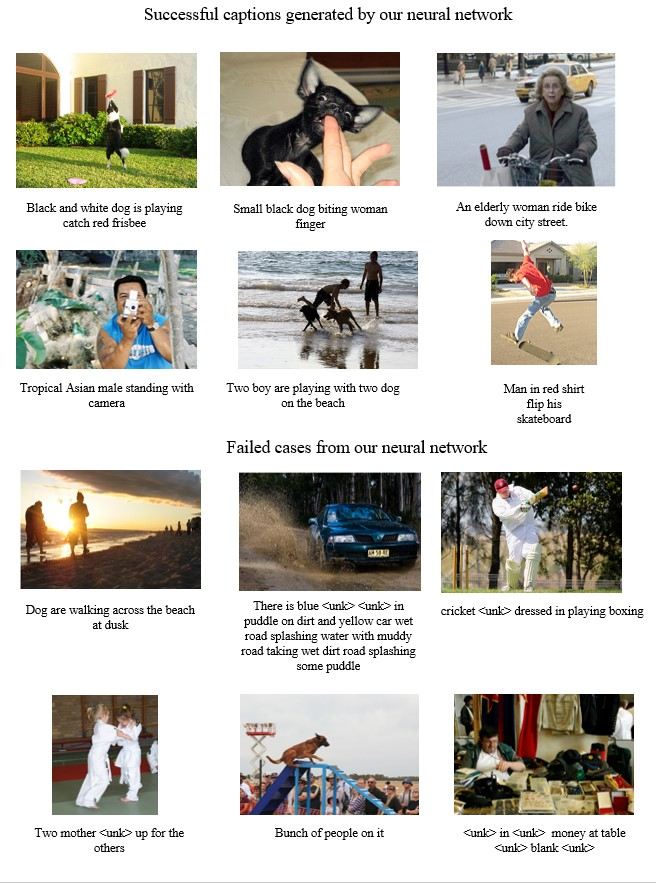

Finally, we show some examples of computer generated captions along with blue scores on the test dataset.

  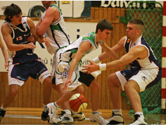

Prediction Caption: four basketball player in green
Real Captions:

1. player from the white and green high school team dribble down court defended by player from the other team
2. four basketball player in action
3. four men playing basketball two from each
4. two boy in green and white uniform play basketball with two boy in blue and white uniform
5. young men playing basketball in competition
   BLEU Score 1-> 100.00
   BLEU Score 2-> 100.00
   BLEU Score 3-> 87.48

  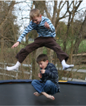

Prediction Caption: boy jump over te trampoline
Real Cptions:

1. boy jumping over another boy on trampoline
2. boy jump over another boy on trampoline
3. one boy jump over another boy on trampoline
4. the little boy jump over another little boy on the trampoline
5. two boy jumping on trampoline
   BLEU Score 1-> 100.00
   BLEU Score 2-> 86.60
   BLEU Score 3-> 63.29

The above two captions are examples of very good captions, which very relevant to the situation in the image.But not all captions are relevant like these examples.

  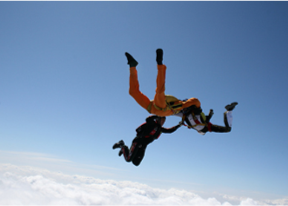

Prediction Caption: dog jumping towards the side
Real Captions:

1. black and tan dog roll on his back in field
2. black dog rolling in the green grass
3. dog roll on his back
4. dog roll on his back in the grass
5. dog with paw in the air lying on grass
   BLEU Score 1-> 40.00
   BLEU Score 2-> 0.00
   BLEU Score 3-> 0.00

  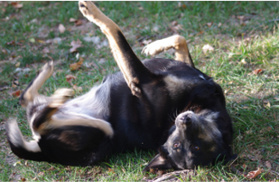

Prediction Caption: three red **<unk>** attire dive and near
Real Captions:

1. three person sky dive team in the air performing stun
2. three people wearing parachute are free falling together through the sky
3. three skydiver are in formation above the cloud
4. trio of skydiver holding hand in sky
5. two people are parachuting over white cloud
   BLEU Score 1-> 28.22
   BLEU Score 2-> 0.00
   BLEU Score 3-> 0.00

In the above case the model is struggling to predict the captions, from Fig6 we can tell that the attention weights are not correct. This can be improved by training on a larger data set.

  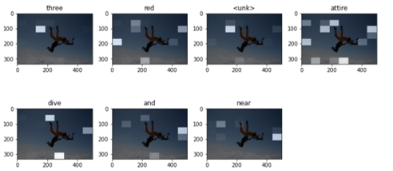

### **CONCLUSION**

We have developed a neural network architecture for image captioning and reported its accuracy on the Flickr dataset. We have also extended the architecture to use attention models, and showed some initial results from this investigation. The current experiments are encouraging, giving a reasonably good BLEU score with little training.

### **ACKNOWLEDGEMENT**

The authors would like to thank IEEE for conducting envision project and Mentors for their support,friendly advice and inspiration to do this work.

### **REFERENCES**

1. Christian Szegedy, Vincent Vanhoucke, Sergey Ioffe, Jonathon Shlens , and Zbigniew Wojna. Rethinking the Inception Architecture for Computer Vision. 2015.

2. Kyunghyun Cho, Bart Van Merrienboer,Caglar Gulcehre, Dzmitry Bahdanau, Fethi Bougares,Holger Schwenk, and Yoshua Bengio. 2014. Learning phrase representations using rnn encoder-decoder for statistical machine translation.

3. [Gabriel Loye, Attention Mechanism. 2015.](https://blog.floydhub.com/)

4. [Understanding LSTM Models. 2015.](https://colah.github.io/)

5. [Andrej Karpathy, The Unreasonable Effectiveness of Recurrent Neural Networks. 2015.](http://karpathy.github.io/)

6. [Andrej Karpathy. 2015. Cs231n: Convolutional neural networks for visual recognition.](http://cs231n.github.io/.)

7. [Harshall Lamba. Image Captioning with Keras. 2018.](https://towardsdatascience.com/.)

8. [Tensorflow. Image captioning with visual attention.](https://www.tensorflow.org/overview.)

9. [Bharath Raj. A Simple Guide to the Versions of the Inception Network. 2018.](https://towardsdatascience.com/>)

10. [Subham Sarkar. Image Captioning using Attention Mechanism. 2020.](https://github.com/SubhamIO/)

11. [JournalDev. How to calculate BLEU score using Phython. 2020.](https://www.journaldev.com/)

12. Andrea Galassi , Marco Lippi , and Paolo Torroni.Attention in Natural Language Processing. 2020.

13. Ashish Vaswani, Noam Shazeer, Niki Parmar, Jakob Uszkoreit, Llion Jones, Aidan N. Gomez, Lukasz Kaiser, Illia Polosukhin. 2017.Attention Is All You Need.**arXiv preprint arXiv:1706.03762**

14. Dzmitry Bahdanau, Kyunghyun Cho, Yoshua Bengio. 2016.Neural Machine Translation by Jointly Learning to Align and Translate.**arXiv preprint arXiv:1409.0473**

15. Kishore Papineni, Salim Roukos,Todd Ward, and Wei-Jing Zhu. Bleu: a method for automatic evaluation of machine translation. Proceedings of the 40th annual meeting on association for computational linguistics 2002 , pages 311–318

16. Pierre Sermanet, David Eigen, Xiang Zhang, Michael Mathieu, Rob Fergus, and Yann LeCun. 2013. Overfeat: Integrated recognition, localization and detection using convolutional networks.**arXiv preprint arXiv:1312.6229**

17. Simonyan and Zisserman2014 Karen Simonyan and Andrew Zisserman. 2014. Very deep convolutional networks for large-scale image recognition.**arXiv preprint arXiv:1409.1556.**

18. [Harshall Lamba. 2019.A Guide to build Sequence to sequence models using LSTM.](https://towardsdatascience.com/.)

19. Szegedy et al.2015 Christian Szegedy, Wei Liu, Yangqing Jia, Pierre Sermanet, Scott Reed, Dragomir Anguelov, Dumitru Erhan, Vincent Vanhoucke, and Andrew Rabinovich. 2015. Going deeper with convolutions.

20. Karen Simonyan, Andrew Zisserman. 2014. Very Deep Convolutional Networks for Large-Scale Image Recognition.**arXiv preprint arXiv:1409.1556**

21. Justin Johnson, Andrej Karpathy, Li Fei-Fei. 2015. DenseCap: Fully Convolutional Localization Networks for Dense Captioning.**arXiv preprint arXiv:1511.07571.**

22. Oriol Vinyals, Alexander Toshev, Samy Bengio, Dumitru Erhan. 2015. Show and Tell: A Neural Image Caption Generator.**arXiv preprint arXiv:1411.4555.**

23. Russakovsky et al.2015 Olga Russakovsky, Jia Deng,Hao Su, Jonathan Krause, Sanjeev Satheesh, Sean Ma, Zhiheng Huang, Andrej Karpathy, Aditya Khosla,Michael Bernstein, et al. 2015. Imagenet large scale visual recognition challenge. IJCV, 115(3):211–252.

24. [Vihar Kurama. 2020. A Review of Popular Deep Learning Architectures: ResNet, InceptionV3, and SqueezeNet](https://blog.paperspace.com/tag/deep-learning/.)

25. [Blaine Rister,Dieterich Lawson. 2016. Image Captioning with Attention](http://cs231n.stanford.edu/reports/2016/pdfs.)
